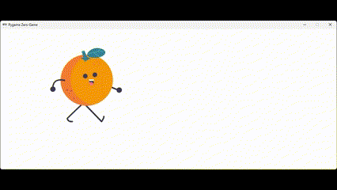

# Naranja Caminando 🍊

¡Bienvenido al proyecto **Naranja Caminando**! Este proyecto permite a una naranja en pantalla simular movimiento mediante un cambio continuo de sprites, logrando un efecto visual de desplazamiento.



## Descripción 📖

Este proyecto fue desarrollado en Python usando la biblioteca **Pygame Zero**. La animación de la naranja se crea utilizando un total de 16 sprites diferentes, que cambian rápidamente para dar la impresión de que el objeto "camina" o se desplaza.

## Características 🚀

- **Animación fluida**: Cambio de 16 sprites para crear un movimiento suave y natural.
- **Desarrollado en Python**: Aprovechando la simplicidad y potencia de Python.
- **Pygame Zero**: Ideal para proyectos de animación y juegos ligeros.

## Requisitos 📋

- **Python** (versión 3.6 o superior)
- **Pygame Zero**

Puedes instalar **Pygame Zero** fácilmente con pip:
```bash
pip install pgzero
```
>## Cómo ejecutar el proyecto
>1. Clona este repositorio en tu equipo:
>   ```bash
>   git clone https://github.com/jordanaescalona/juegos-naranja-caminando.git
>   ```
>3. Navega al directorio del proyecto:
>   ```bash
>   cd naranja-caminando
>   ```
>4. Ejecuta el proyecto con Pygame Zero:
>   ```bash
>   pgzrun.py main.py
>   ```
